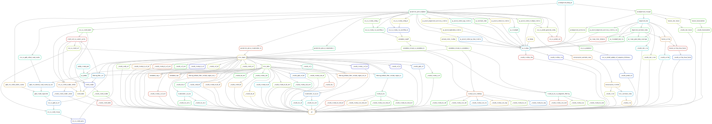

# :dog: :dog: :dog: :notes: WGS Leukemia Fluffy :snake:

Snakemake workflow to analyse hematological malignancies in whole genome data


[](https://opensource.org/licenses/gpl-3.0.html)

## :speech_balloon: Introduction

This snakemake workflow uses modules from hydragenetics to process `.fastq` files and obtain different kind
of variants (SNV, indels, CNV, SV). Alongside diagnosis-filtered `.vcf` files, the workflow produces a
multiqc report `.html` file and some CNV plots and `.tsv` files with relevant information from mutect and Manta. One of the modules contains the **commercial**
[parabricks toolkit](https://docs.nvidia.com/clara/parabricks/3.7.0/index.html) which can be replaced by sentieon or 
opensource GATK tools if required. The following modules are currently part of this pipeline:

- annotation
- cnv_sv
- compression
- filtering
- misc
- parabricks
- prealignment
- qc

## :heavy_exclamation_mark: Dependencies

In order to use this module, the following dependencies are required:

[](https://github.com/hydra-genetics/)
[](https://pandas.pydata.org/)
[](https://docs.nvidia.com/clara/parabricks/3.7.0/index.html)
[](https://www.python.org/)
[](https://snakemake.readthedocs.io/en/stable/)

## :school_satchel: Preparations

### Sample and unit data

Input data should be added to
[`samples.tsv`](https://github.com/clinical-genomics-uppsala/fluffy_hematology_wgs/blob/develop/config/samples.tsv)
and
[`units.tsv`](https://github.com/clinical-genomics-uppsala/fluffy_hematology_wgs/blob/develop/config/units.tsv).
The following information need to be added to these files:

| Column Id | Description |
| --- | --- |
| **`samples.tsv`** |
| sample | unique sample/patient id, one per row |
| tumor_content | ratio of tumor cells to total cells |
| **`units.tsv`** |
| sample | same sample/patient id as in `samples.tsv` |
| type | data type identifier (one letter), can be one of **T**umor, **N**ormal, **R**NA |
| platform | type of sequencing platform, e.g. `NovaSeq` |
| machine | specific machine id, e.g. NovaSeq instruments have `@Axxxxx` |
| flowcell | identifer of flowcell used |
| lane | flowcell lane number |
| barcode | sequence library barcode/index, connect forward and reverse indices by `+`, e.g. `ATGC+ATGC` |
| fastq1/2 | absolute path to forward and reverse reads |
| adapter | adapter sequences to be trimmed, separated by comma |

### Reference data

Reference files should be specified in
[`config.yaml`](https://github.com/clinical-genomics-uppsala/fluffy_hematology_wgs/blob/develop/config/config.yaml)

1. A `.fasta` reference file of the human genome is required as well as an `.fai` file and an bwa index of this
file.
2. A `.vcf` file containing known indel sites. For GRCh38, this file is available as part of the Broad GATK
resource bundle at
[google cloud](https://storage.googleapis.com/genomics-public-data/resources/broad/hg38/v0/Homo_sapiens_assembly38.known_indels.vcf.gz).
3. An `.interval_list` file containing all whole genome calling regions. The GRCh38 version is also available at
[google cloud](https://storage.googleapis.com/genomics-public-data/resources/broad/hg38/v0/wgs_calling_regions.hg38.interval_list).
4. The `trimmer_software` should be specified by indicating a rule which should be used for trimming. This
pipeline uses `fastp_pe`.
5. `.bed` files defining regions of interest for different diagnoses. This pipeline is assuming `ALL` and `AML`
and different gene lists for SNVs and SVs.
6. For pindel, a `.bed` file containing the region that the analysis should be limited to.
7. [simple_sv_annotation](https://github.com/AstraZeneca-NGS/simple_sv_annotation) comes with panel and a fusion
pair list which should also be included in the `config.yaml`.
8. Annotation with [SnpEff](http://pcingola.github.io/SnpEff/) a database is needed which can be downloaded through
the cli.
9. For [VEP](https://www.ensembl.org/info/docs/tools/vep/index.html), a cache resource should be downloaded prior
to running the workflow.

## :rocket: Usage

To run the workflow,
[`resources.yaml`](https://github.com/clinical-genomics-uppsala/fluffy_hematology_wgs/blob/develop/config/resources.yaml)
is needed which defines different resources as default and for different rules. For parabricks, the `gres`
stanza is needed and should specify the number of GPUs available. You also need a [`config.yaml`](https://github.com/clinical-genomics-uppsala/fluffy_hematology_wgs/blob/develop/config/config.yaml) where all run-variables are defined. 

```bash
snakemake --profile my-profile --configfile config/config.yaml
```

To run the integration test you only need to add lines in the `tests/integration/config.yaml` that differs from the original `config.yaml`. As of now it is only a dryrun test, no small dataset is available.

```bash
cd .tests/integration/
snakemake --snakefile ../../workflow/Snakefile --configfiles ../../config/config.yaml config.yaml -n
```
### Output files

.fastq files are archived as compressed file pair as .spring: `Archive/{project}/{sample}_{flowcell}_{lane}_{barcode}_{type}.spring`

The MultiQC html report can be found here: `Results/MultiQC_TN.html`

All results (as described in table below) are located in: `Results/{project}/{sample}/`

| File | Description |
|---|---|
| `Cram/{sample}_{type}.crumble.cram` | crumbled `.cram` file |
| `Cram/{sample}_{type}.crumble.cram.crai` | index for crumbled `.cram` file |
| `SNV_indels/{sample}_T.vep.vcf.gz` | `.vcf` output for SNV and small indels annotated with VEP for tumor_only |
| `SNV_indels/{sample}_T.vep.vcf.gz.tbi` | index for `.vcf` output from VEP for tumor_only |
| `SNV_indels/{sample}_TN.vep.vcf.gz` | `.vcf` output from VEP for tumor/normal |
| `SNV_indels/{sample}_TN.vep.vcf.gz.tbi` | index for `.vcf` output from VEP for tumor/normal|
| `SNV_indels/{sample}_TN.vep.all.vcf.gz` |  `.vcf` output from VEP for tumor/normal, hard-filtered for ALL genes |
| `SNV_indels/{sample}_TN.vep.all.vcf.gz.tbi` | index for  `.vcf` output from VEP for tumor/normal, hard-filtered for ALL genes |
| `SNV_indels/{sample}_TN.vep.aml.vcf.gz` |  `.vcf` output from VEP for tumor/normal, hard-filtered for AML genes  |
| `SNV_indels/{sample}_TN.vep.aml.vcf.gz.tbi` | index for `.vcf` output from VEP for tumor/normal, hard-filtered for AML genes  |
| `SNV_indels/{sample}_mutectcaller_TN.all.tsv` | `.tsv` file for excel containing SNVs and small indels from mutect2 for ALL  |
| `SNV_indels/{sample}_mutectcaller_TN.aml.tsv` | `.tsv` file for excel containing SNVs and small indels from mutect2 for AML  |
| `SNV_indels/{sample}.pindel.vcf.gz` | `.vcf` output from pindel  |
| `SNV_indels/{sample}.pindel.vcf.gz.tbi` | index for `.vcf` output from pindel  |
| `CNV/{sample}_T.vcf.gz` | `.vcf` output from cnvkit |
| `CNV/{sample}_T.vcf.gz.tbi` | index for `.vcf` output from cnvkit |
| `CNV/{sample}_{type}.CNV.xlsx` | Excel file containing overview of CNVkit results |
| `CNV/{sample}_T.png` | scatter plot from cnvkit for entire genome |
| `CNV/{sample}_T_chr{chr}.png` | scatter plot per chromosome from cnvkit |
| `SV/{sample}_manta_TN.ssa.vcf.gz` | `.vcf` output from Manta |
| `SV/{sample}_manta_TN.ssa.vcf.gz.tbi` | index for `.vcf` output from Manta  |
| `SV/{sample}_manta_TN.ssa.all.vcf.gz` | `.vcf` output from Manta filtered for ALL genes |
| `SV/{sample}_manta_TN.ssa.all.vcf.gz.tbi` | index for `.vcf` output from Manta filtered for ALL genes |
| `SV/{sample}_manta_TN.ssa.aml.vcf.gz` | `.vcf` output from Manta filtered for AML genes |
| `SV/{sample}_manta_TN.ssa.aml.vcf.gz.tbi` | index for `.vcf` output from Manta filtered for AML genes |
| `SV/{sample}_manta_TN.del.tsv` | `.tsv` file for excel containing deletions found by Manta (filtered) |
| `SV/{sample}_manta_TN.ins.tsv` | `.tsv` file for excel containing insertions found by Manta (filtered) |
| `SV/{sample}_manta_TN.dup.tsv` | `.tsv` file for excel containing duplications found by Manta (filtered) |
| `SV/{sample}_manta_TN.bnd.tsv` | `.tsv` file for excel containing breakends found by Manta (filtered) |
| `SV/{sample}_manta_TN.bnd.all.tsv` | `.tsv` file for excel containing breakends found by Manta (filtered), filtered for ALL genes |
| `SV/{sample}_manta_TN.bnd.aml.tsv` |  `.tsv` file for excel containing breakends found by Manta (filtered), filtered for AML genes|


### Program versions

default container: `docker://hydragenetics/common:0.1.9`

| Program | Version | Container | 
|---|---|---|
| Arriba | 2.3.0 | `docker://hydragenetics/arriba:2.3.0` |
| CNVkit | 0.9.9 | `docker://hydragenetics/cnvkit:0.9.9` `docker://python:3.9.9-slim-buster` |
| Crumble | 0.8.3 | `docker://hydragenetics/crumble:0.8.3` |
| fastp | 0.20.1 | `docker://hydragenetics/fastp:0.20.1` |
| FastQC | 0.11.9 | `docker://hydragenetics/fastqc:0.11.9` |
| FusionCatcher | 1.33 | `docker://blcdsdockerregistry/fusioncatcher:1.33` |
| Manta | 1.6.0 | `docker://hydragenetics/manta:1.6.0` |
| Mosdepth | 0.3.2 | `docker://hydragenetics/mosdepth:0.3.2` |
| MultiQC | 1.11 | `docker://hydragenetics/multiqc:1.11` |
| Picard | 2.25.0 | `docker://hydragenetics/picard:2.25.0` |
| Pindel | 0.2.5b9 | `docker://hydragenetics/pindel:0.2.5b9` |
| RSeQC | 4.0.0 | `docker://hydragenetics/rseqc:4.0.0` |
| simple_sv_annotation.py  | 2019.02.18 | `docker://hydragenetics/simple_sv_annotation:2019.02.18` |
| snpEff | 5.0 | `docker://hydragenetics/snpeff:5.0` |
| SortMeRNA | 4.3.4 | `docker://hydragenetics/sortmerna:4.3.4` |
| SPRING | 1.0.1 | `docker://hydragenetics/spring:1.0.1` |
| STAR | 2.7.10a | `docker://hydragenetics/star:2.7.10a` |
| STAR-Fusion | 1.10.1 | `docker://trinityctat/starfusion:1.10.1` |
| VEP | 105 | `docker://hydragenetics/vep:105` |

## :judge: Rule Graph


