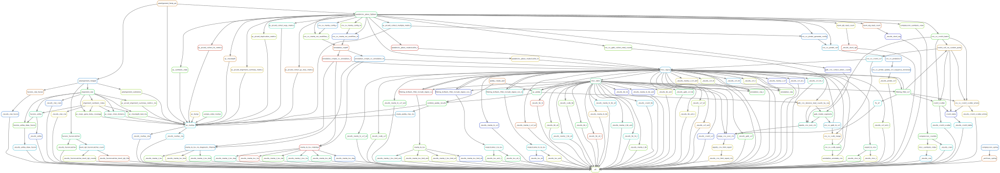

# :dog: :dog: :dog: :notes: Welcome to Fluffy - Hematology WGS and WTS pipeline :snake:

<a href="https://github.com/clinical-genomics-uppsala/fluffy_hematology_wgs/">https://github.com/clinical-genomics-uppsala/fluffy_hematology_wgs/</a>

This pipeline is created to run on short-read whole genome and/or whole transcriptome Illumina data, designed at [Clinical Genomics Uppsala](https://www.scilifelab.se/units/clinical-genomics-uppsala/#https://www.cgu.igp.uu.se).

This snakemake pipeline uses the module system from [Hydra Genetics](https://github.com/hydra-genetics/) to process `.fastq.gz` files. The pipeline produces several output files such as a MultiQC `.html` report with QC-data, `.bam`/`.cram` alignment files, annotated `.vcf.gz` for SNVs and smaller indels, as well as `.txt`-files with RNA fusion results. For more indepth lists see [Result files](/results)

 
Fluffy :dog: :dog: :dog: :notes: uses the following hydra genetics modules:

- [Alignment](https://github.com/hydra-genetics/alignment/tree/v0.4.0)
- [Annotation](https://github.com/hydra-genetics/annotation/tree/3a05574)
- [CNV](https://github.com/hydra-genetics/cnv_sv/tree/v0.4.1)
- [Compression](https://github.com/hydra-genetics/compression/tree/v1.1.0)
- [Filtering](https://github.com/hydra-genetics/filtering/tree/v0.3.0)
- [Misc](https://github.com/hydra-genetics/misc/tree/v0.1.0)
- [Prealignment](https://github.com/hydra-genetics/prealignment/tree/v1.1.0)
- [QC](https://github.com/hydra-genetics/qc/tree/v0.3.0)
- [Reports](https://github.com/hydra-genetics/reports/tree/7c8b8c5)
- [SNV indels](https://github.com/hydra-genetics/snv_indels/tree/v0.6.0)

Together with either the [Parabricks](https://github.com/hydra-genetics/parabricks/tree/v1.1.0) or [Sentieon](https://github.com/hydra-genetics/sentieon/tree/b002d39) modules.

> **_NOTE:_** Since both parabricks and sentieon are not open-source a license of either is need to run the Fluffy at the moment. To enable an open-source version of Fluffy is on the to-do list.

### :judge: Rulegraph 
{: style="height:100%;width:100%"}

---
# Hydra-genetics

[Hydra Genetics](https://github.com/hydra-genetics/) is an organization/community with the goal of making [snakemake](https://snakemake.readthedocs.io/en/stable/index.html) pipeline development easier, faster, a bit more structured and of higher quality.

We do this by providing [snakemake modules](https://snakemake.readthedocs.io/en/stable/snakefiles/modularization.html#modules) that can be combined to create a complete analysis or included in already existing pipelines. All modules are subjected to extensive testing to make sure that new releases doesn't unexpectedly break existing pipeline or deviate from guidelines and best practices on how to write code.

There is also a small [tutorial](https://hydra-genetics.readthedocs.io/en/latest/simple_pipeline/) available to help you get started with Hydra-genetics.

# Snakemake
Fluffy and Hydra-genetics are snakemake bases pipeline/tools. The [Snakemake](https://snakemake.readthedocs.io/en/stable/index.html) workflow management system is a tool to create reproducible and scalable data analyses. Workflows are described via a human readable, Python based language. They can be seamlessly scaled to server, cluster, grid and cloud environments, without the need to modify the workflow definition. Finally, Snakemake workflows can entail a description of required software, which will be automatically deployed to any execution environment. 

If Snakemake is new to you a good place to start is doing the [snakemake tutorial](https://snakemake.readthedocs.io/en/stable/tutorial/tutorial.html) since this will help you setting Fluffy up.
