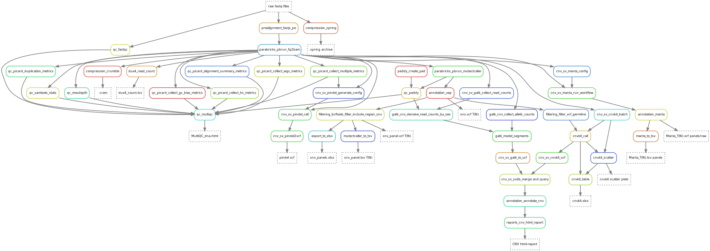
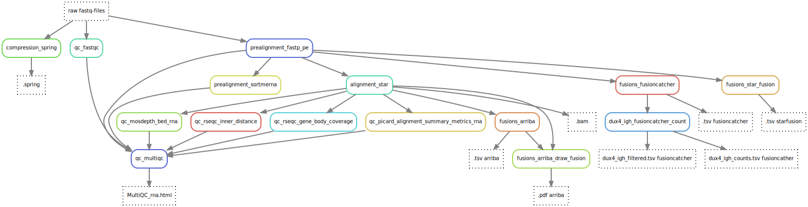

# :dog::dog::dog::notes: Fluffy - Hematology WGS and WTS pipeline :snake:
The Fluffy pipeline is designed to be able to process both DNA and RNA whole transcriptome/genome sequencing and therefore have two parallel tracks. The DNA track you can run either with a match normal or as tumor only sample. The RNA part is designed to primarily identify fusions. 
Here follows a brief overview of the pipelines:

## DNA
The DNA-part of the pipeline allows for both tumor only analysis and tumor with a match normal analysis. It generates SNV-calls and summarizes them into different panels and formats. It also does CNV calling using a combination of both CNVkit and GATK to then summarize it into one html-report. To identify SVs Manta is used. It also runs several different QC-programs which are then summarized in an MultiQC-report. 

{: style="height:100%;width:100%"}

## RNA
Fluffy can also process whole transcriptome data to identify potential fusions. It starts with unmapped short-read sequences which is then process through several different steps which includes three different fusion callers to optimize chance to find the fusions. It runs several different QC-programs which then are aggregated in a MultiQC-report.

 - [STAR-fusion](https://github.com/STAR-Fusion/STAR-Fusion/tree/v1.10.0)
 - [Arriba](https://arriba.readthedocs.io/en/v2.3.0/)
 - [Fusioncatcher](https://github.com/ndaniel/fusioncatcher/tree/1.33)

The pipeline uses several different [Hydra Genetics](https://hydra-genetics.readthedocs.io/en/latest/) modules together with some small in-house developed scripts to summarize results.

[Hydra Genetics](https://hydra-genetics.readthedocs.io/en/latest/) modules used:
 - [Prealignment](https://github.com/hydra-genetics/prealignment/tree/v1.1.0)
 - [Alignment](https://github.com/hydra-genetics/alignment/tree/v0.4.0)
 - [Fusions](https://github.com/hydra-genetics/fusions/tree/12f8354)
 - [QC](https://github.com/hydra-genetics/qc/tree/v0.3.0)
 - [Compression](https://github.com/hydra-genetics/compression/tree/v1.1.0)

{: style="height:100%;width:100%"}