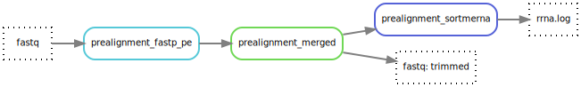

# RNA - Prealignment
{: style="height:100%;width:100%"}

From the [prealignment module](https://hydra-genetics-prealignment.readthedocs.io/en/latest/) the rules fastp, merge and sortmerna is used. 

Fastp (v0.20.1) takes paired fastq-reads and the adapter sequence from the `units.tsv` file and trim the reads per lane. Merging of fastq files belonging to the same sample are performed by simply concatenating the files with cat, one fastq per read direction. [SortMeRNA](https://github.com/sortmerna/sortmerna) (v4.3.4) also runs to be used in the MultiQC report or contamination investigation.

## Pipeline output files
Only intermediate files are generated.

## Configuration
### Software settings
|Option| Value| Description|
|---|---|---|
|**SortMeRNA** | :~~: | ~~ |
|fasta| list of fasta files | fasta databases to be used by sortmerna |
| | `rfam-5.8s-database-id98.fasta` | included in [software](https://github.com/sortmerna/sortmerna?tab=readme-ov-file#databases) but needs to be unpacked|
| | `rfam-5s-database-id98.fasta` |included in [software](https://github.com/sortmerna/sortmerna?tab=readme-ov-file#databases) but needs to be unpacked|
| | `silva-bac-16s-id90.fasta` |included in [software](https://github.com/sortmerna/sortmerna?tab=readme-ov-file#databases) but needs to be unpacked|
| | `silva-bac-23s-id98.fasta` |included in [software](https://github.com/sortmerna/sortmerna?tab=readme-ov-file#databases) but needs to be unpacked|
| | `silva-euk-18s-id95.fasta` |included in [software](https://github.com/sortmerna/sortmerna?tab=readme-ov-file#databases) but needs to be unpacked|
| | `silva-euk-28s-id98.fasta` |included in [software](https://github.com/sortmerna/sortmerna?tab=readme-ov-file#databases) but needs to be unpacked|
| index | `idx` | SortmeRNA index of human reference genome|

### Resources